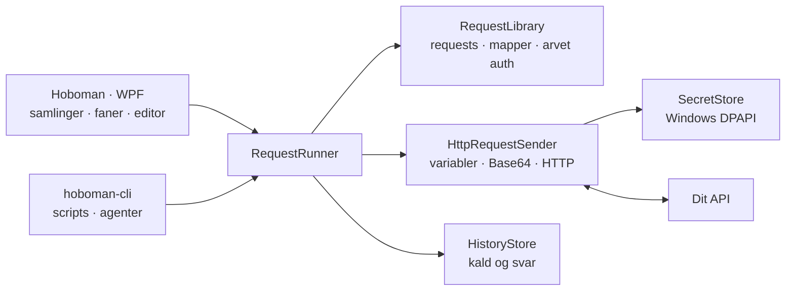

<p align="center">
  
</p>

<h1 align="center">Hoboman</h1>

<p align="center">
  En lokal HTTP-klient til Windows med samlinger, miljøer, OAuth og styr på dine requests.
</p>

Hoboman er et skrivebordsværktøj til at bygge, sende og undersøge API-kald. Requests organiseres i mapper, autentificering kan nedarves, og historikken gemmer tidligere kald og svar. Data ligger lokalt ved siden af programmet — uden krav om en konto hos Hoboman eller en cloud-tjeneste.

## Det får du

- **Request og svar i separate paneler** – panelerne ligger over hinanden med en justerbar splitter. Brug HTTP-metoder, query-parametre, headers og body som JSON, XML, tekst eller ingen body. Svaret viser status, svartid, størrelse, headers og indhold.
- **Samlinger med undermapper** – opret requests direkte i en mappe, flyt requests og mapper med drag-and-drop, og gem deres rækkefølge.
- **Faner og drafts** – se ugemte requests i samlingerne, omdøb faner med dobbeltklik, og træk dem i den ønskede rækkefølge. Gemte faner og deres rækkefølge gendannes ved næste start.
- **Miljøer og variabler** – brug `{{variabel}}` i URL, parametre, headers og auth-felter. Appen husker det senest valgte miljø.
- **Auth med nedarvning** – ingen auth, Basic, Bearer og OAuth 2.0. En undermappe kan overtage eller tilsidesætte auth fra sin overmappe.
- **OAuth uden omveje** – client credentials eller authorization code med PKCE og browser-login. Hent et nyt token direkte ved Auth-fanen; ved client credentials hentes det automatisk, når det mangler eller er udløbet. Tokens holdes adskilt pr. miljø og følger miljøet, også når det omdøbes. Tokens gemt før miljøerne fik id, skal hentes igen én gang.
- **Base64 efter dit valg** – markér bestemte JSON-felter til encoding ved afsendelse eller decoding i svaret. Hele bodyen kan også vælges.
- **Små værktøjer i hverdagen** – JSON/XML-formatering, sammenfoldning af JSON, stringify/parse og Base64 til udklipsholderen samt dansk og engelsk brugerflade.
- **Workflows** – kæd requests og scripts sammen i `workflows\<navn>\workflow.json` uden at røre samlingerne, giv værdier fra ét svar videre til de næste trin, og kør det hele under **Workflows** i appen eller med `hoboman-cli run`. Hver kørsel skrives som JSON-linjer, som en AI kan følge.
- **Kommandolinje** – send gemte og direkte requests og kør workflows fra scripts og AI-agenter med `hoboman-cli.exe`. Se [CLI.md](CLI.md).

## Kom hurtigt i gang

### Krav

- Windows – appen bruger WPF og Windows' beskyttelse af hemmeligheder.
- [.NET 10 SDK](https://dotnet.microsoft.com/en-us/download/dotnet/10.0) til at bygge, teste og køre fra kildekoden.
- En standardbrowser, hvis du bruger OAuth authorization code.

Appen publiceres som self-contained med .NET-runtime inkluderet, så den færdige app kræver ikke en separat installation af .NET. SDK'et kræves stadig til at bygge appen, også via `install.ps1`. Programmet skal ligge i en mappe, hvor din bruger kan skrive, fordi det gemmer data ved siden af sig selv.

### Kør fra kildekoden

Kør fra repositoryets rod:

```powershell
dotnet run --project .\src\Hoboman\Hoboman.csproj
```

Vælg metode, skriv en URL, tilføj eventuel body og auth, og tryk **Send** eller **Ctrl+Enter**. Nye requests starter på Body-fanen med JSON valgt; gemte requests beholder deres body-format.

### Installer i Start-menuen

```powershell
.\install.ps1
```

Scriptet publicerer appen og `hoboman-cli.exe` til `publish\`, opretter en genvej i Start-menuen og starter `Hoboman.exe`. Hvis den publicerede app allerede kører, beder scriptet dig lukke den først, så ugemte requests ikke bliver lukket ned bag din ryg.

## Arbejd med requests

### Mapper, navne og faner

- Klik **+ ved en mappe** for at oprette et draft i netop den mappe. Mappeikonet med plus opretter en undermappe.
- Navnefeltet er kun et navn. Placeringen bestemmes af mappen, ikke af `/` eller `\` i navnet.
- Flyt requests og mapper ved at trække dem. En ramme markerer en destinationsmappe; en linje viser placeringen mellem elementer.
- Højreklik på en request i **Samlinger**, og vælg **Klon** for at lave en kopi i samme mappe med et nummer efter navnet.
- Dobbeltklik på en fane for at omdøbe den. Omdøbning af et draft gemmer requesten.
- Ugemte drafts gendannes ikke efter genstart. Gemte requests åbnes igen med den gemte fanerækkefølge.

### Miljøvariabler og body

Opret eksempelvis variablen `host` i et miljø, og brug `https://{{host}}/api/users` som URL. Variabler kan bruges i både navne og værdier for parametre og headers. Ukendte variabler bliver stående som skrevet.

**Brug miljøvariabler i body** er slået fra som standard. Derfor kan en body indeholde eksempelvis `{{this.name}}` fra en Handlebars-template uden at blive ændret. Slår du funktionen til, indsættes miljøvariablerne før eventuel Base64-encoding.

### Arvet auth

Vælg **Arv fra mappe** for at bruge auth fra den nærmeste overmappe, der har en selvstændig auth-indstilling. Egen auth på requesten tilsidesætter mappe-auth; **Ingen** stopper nedarvningen.

Auth-fanen viser den effektive auth-type. Ved arvet OAuth henter refresh-knappen tokenet på den mappe, som ejer indstillingen. Flytning til en anden mappe ændrer den arvede auth. Ved client credentials henter Hoboman selv et nyt token og sender igen, når tokenet mangler, er udløbet, eller serveren svarer 401. Ved authorization code skal tokenet hentes med refresh-knappen.

### Base64 og udklipsholder

Markeringerne ved JSON-felterne bestemmer præcis, hvilke værdier der sendes som Base64. Strings encodes som UTF-8-tekst; objekter og andre JSON-værdier encodes som deres JSON. Ingen feltnavne har særbehandling.

Encoding ændrer det, der sendes, ikke teksten i editoren. Decoding af svaret ændrer visningen, ikke det oprindelige svar i historikken. Ved encoding af hele bodyen beholdes den valgte Content-Type; tilpas den i Headers, hvis API'et kræver noget andet.

Knapperne **Stringify**, **Parse**, **Base64 Encode** og **Base64 Decode** arbejder separat på teksten i udklipsholderen. Grøn feedback betyder, at ændringen lykkedes; rød betyder, at den ikke kunne udføres.

## Sådan hænger det sammen



`App.xaml.cs` registrerer afhængighederne med dependency injection. Views og viewmodels ligger i `Hoboman`, mens HTTP, OAuth, variabler, Base64 og filbaseret lagring ligger i `Hoboman.Core` uden WPF. `Hoboman.Cli` er et tyndt konsolprogram oven på den samme core.

`RequestRunner` finder den gældende auth, sender kaldet gennem `HttpRequestSender` og gemmer resultatet i historikken. Mangler et token, som kan hentes uden login, henter den et nyt og sender én gang til. `AuthRefreshService` samordner tokenhentning, og `CollectionChanges` sørger for, at appens gemning, flytning og sletning ikke udføres oven i hinanden. En filovervåger opdaterer appen, når lokale data ændres udefra.

## Projektet

```text
Hoboman/
├─ src/Hoboman/          WPF, viewmodels, editor og Windows-integrationer
├─ src/Hoboman.Core/     HTTP, OAuth, secrets, variabler, Base64 og lagring
├─ src/Hoboman.Cli/      Kommandolinjeværktøjet hoboman-cli
├─ tests/Hoboman.Tests/  xUnit-tests af core, viewmodels og UI
├─ install.ps1          Publish og genvej i Start-menuen
├─ CLI.md               Brug af kommandolinjeværktøjet
└─ Hoboman.slnx          Solution
```

### Build og test

```powershell
dotnet build .\Hoboman.slnx
dotnet test --solution .\Hoboman.slnx
```

Testprojektet bruger xUnit og Microsoft.Testing.Platform, valgt i `global.json`. Det dækker blandt andet HTTP-kald, OAuth, secret-oprydning, miljøer, Base64, historik, samlinger og faner. Build og tests køres på Windows.

### Tastaturgenveje

| Genvej | Handling |
|---|---|
| `Ctrl+Enter` | Send den aktuelle request, eller kør det viste workflow |
| `Ctrl+S` | Gem den aktuelle request eller det viste workflow |
| `Shift+Alt+F` | Formatér JSON/XML, når fokus er i bodyen |
| `Ctrl+Z` / `Ctrl+Y` | Fortryd/gentag i bodyen, også formatering |
| `Enter` | Åbn det valgte element i samlinger eller historik |

## Lokale data og hemmeligheder

Data gemmes ved siden af den kørende app. Efter `install.ps1` er det i `publish\`, hvor `hoboman-cli.exe` deler dem; ved `dotnet run` er det i projektets build-output, normalt `src\Hoboman\bin\Debug\net10.0-windows\`.

| Sti | Brug |
|---|---|
| `requests\` | Én JSON-fil pr. request, organiseret i de samme mapper som i appen |
| `requests\<mappe>\.folder.json` | Mappens id og auth-indstillinger |
| `request-order.json` | Rækkefølgen af requests og mapper |
| `environments.json` | Miljøer og deres variabler |
| `settings.json` | Valgt miljø, sprog, vindueslayout og gemte faner |
| `secrets.json` | Krypterede passwords, tokens og client secrets fra auth-felterne |
| `pending-secret-cleanup.json` | Ejere, hvis hemmeligheder skal kontrolleres og ryddes op efter sletning |
| `history\` | Ét JSON-dokument pr. gemt kald med request, svar eller fejl |
| `workflows\<navn>\workflow.json` | Ét workflow pr. mappe med parametre, variabler og trin |
| `runs\<workflow-id>\` | Én JSON-linjefil pr. kørsel af et workflow med events, svar og gemte værdier |
| `logs\` | Daglige logfiler |

Auth-hemmeligheder beskyttes med Windows DPAPI for den aktuelle Windows-bruger. De ligger separat fra request- og mappefilerne. En kopi af `secrets.json` er derfor ikke en almindelig, flytbar eksport af loginoplysninger. Ved sletning ryddes tilhørende hemmeligheder op, når ingen tilbageværende request eller mappe bruger dem; afbrudt oprydning kan genoptages ved næste start.

**Resten af dataene er ikke krypterede.** Miljøvariabler, manuelt indtastede headers, bodies, historik, kørsler og logs kan indeholde følsomme oplysninger. Gennemgå dem før deling eller check-in; et token skrevet direkte i en header eller miljøvariabel får ikke automatisk beskyttelsen fra secret-lageret.

## Kommandolinjeværktøj

`hoboman-cli.exe` sender gemte og direkte requests og kører workflows uden GUI'en og skriver resultatet som JSON. Kommandoer, variabler, workflows, events, exitkoder, auth og et eksempel på at kæde kald sammen i PowerShell står i [CLI.md](CLI.md).
