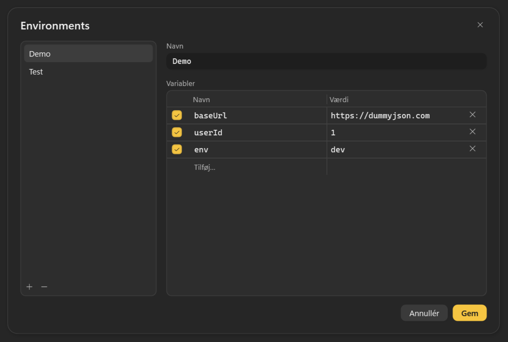
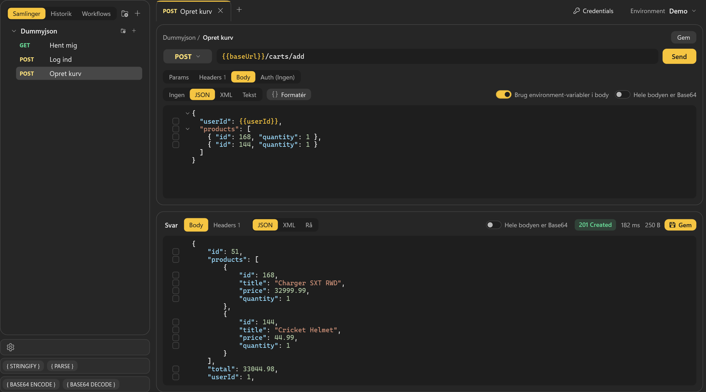
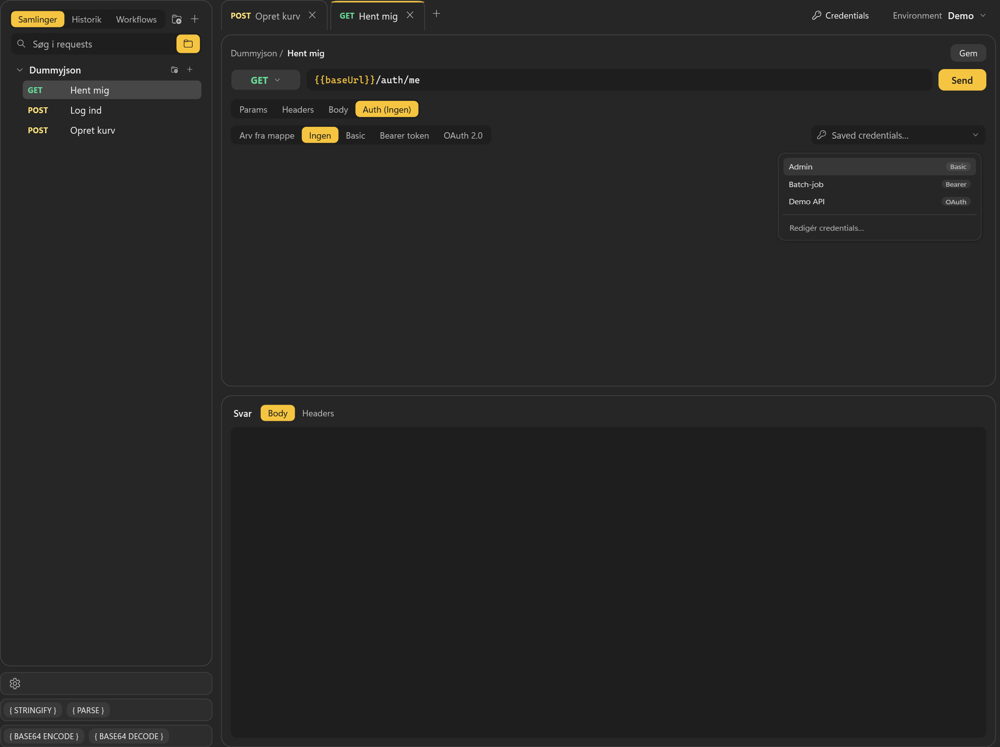
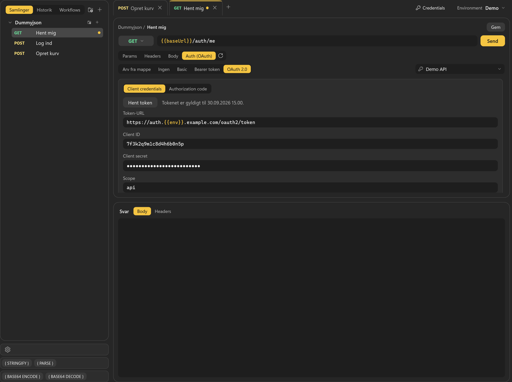
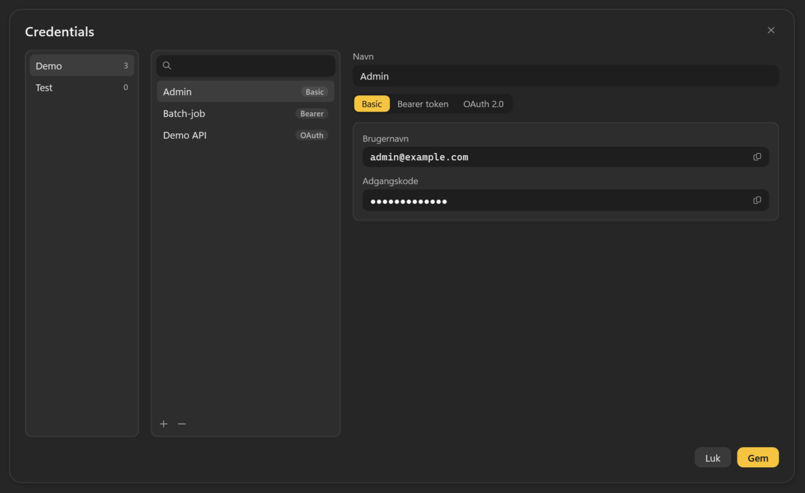
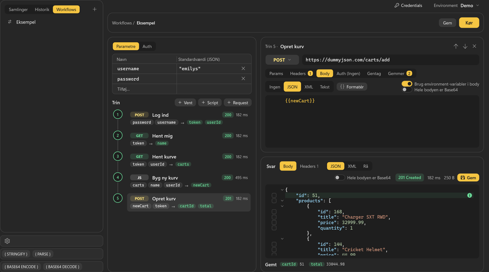
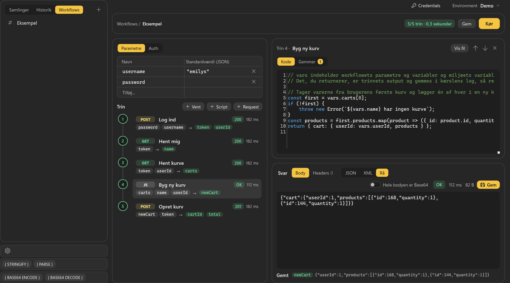
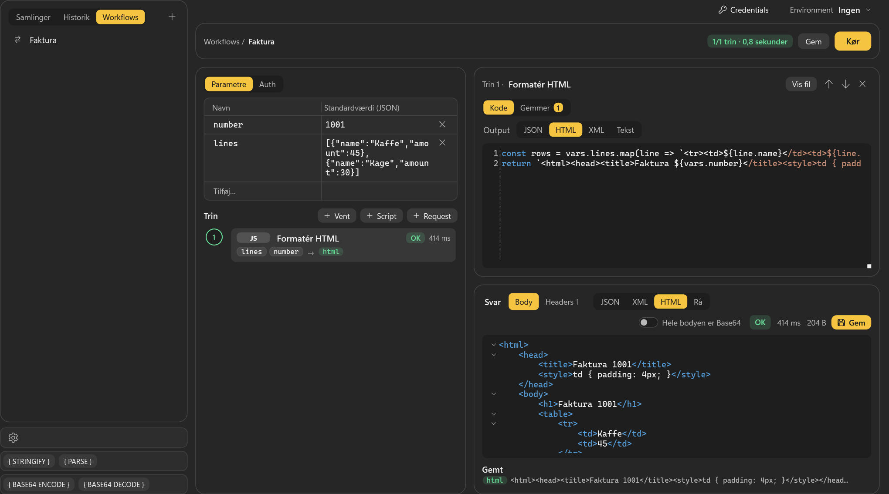
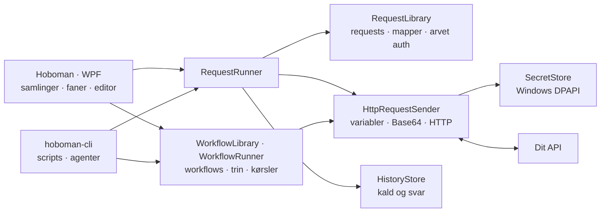

<p align="center">
  
</p>

<h1 align="center">Hoboman</h1>

<p align="center">
  En lokal HTTP-klient til Windows med samlinger, miljøer, OAuth, workflows og styr på dine requests.
</p>

Hoboman er et skrivebordsværktøj til at bygge, sende og undersøge API-kald. Requests organiseres i mapper, autentificering kan nedarves, og historikken gemmer tidligere kald og svar. Data ligger lokalt ved siden af programmet — uden krav om en konto hos Hoboman eller en cloud-tjeneste.

## Det får du

- **Request og svar i separate paneler** – panelerne ligger over hinanden med en justerbar splitter. Brug HTTP-metoder, query-parametre, headers og body som JSON, XML, tekst eller ingen body. Svaret viser status, svartid, størrelse, headers og indhold, og **Gem** i svarets statuslinje gemmer det, præcis som serveren sendte det, som en fil, fx en PDF. Billeder, PDF-filer og HTML kan vises i en indbygget browser.
- **Samlinger med undermapper** – opret requests direkte i en mappe, flyt requests og mapper med drag-and-drop, og gem deres rækkefølge.
- **Faner og drafts** – et draft, du opretter i en mappe, står i samlingerne med en prik, indtil det er gemt. Omdøb faner med dobbeltklik, og træk dem i den ønskede rækkefølge. Gemte faner og deres rækkefølge gendannes ved næste start.
- **Historik** – de 100 seneste kald fra appen og CLI'et, grupperet pr. dag. Et kald åbnes i en fane, så du kan sende det igen. Gamle kald og kørsler kan slettes efter et antal dage.
- **Miljøer og variabler** – brug `{{variabel}}` i URL, parametre, headers og auth-felter. Appen husker det senest valgte miljø.
- **Auth med nedarvning** – ingen auth, Basic, Bearer og OAuth 2.0. En undermappe kan overtage eller tilsidesætte auth fra sin overmappe.
- **Gemte credentials** – gem hele auths, Basic, Bearer token eller OAuth 2.0, pr. miljø under **Credentials** ved siden af miljøvælgeren, og vælg dem i Auth i stedet for at skrive dem igen.
- **OAuth uden omveje** – client credentials eller authorization code med PKCE og browser-login. Hent et nyt token med refresh-knappen ved Auth; ved client credentials hentes det automatisk, når det mangler eller er udløbet. Tokens holdes adskilt pr. miljø og følger miljøet, også når det omdøbes.
- **Base64 efter dit valg** – markér bestemte JSON-felter til encoding ved afsendelse eller decoding i svaret. Hele bodyen kan også vælges.
- **Workflows** – kæd requests, scripts og ventetider sammen, giv værdier fra ét svar videre til de næste trin, og kør det hele under **Workflows** i appen eller med `hoboman-cli run`. Hver kørsel skrives som JSON-linjer, som et script eller en AI kan følge.
- **Kommandolinje og AI** – send gemte og direkte requests, kør, tjek og følg workflows, vis, opret, ret, omdøb, flyt og slet requests, mapper, workflows og miljøer, og læs historikken fra scripts og AI-agenter med `hoboman-cli.exe`. Se [CLI.md](CLI.md) og [AI-PROMPT.md](AI-PROMPT.md).
- **Små værktøjer i hverdagen** – formatering og sammenfoldning af JSON, XML og HTML samt stringify/parse og Base64 af teksten i udklipsholderen.
- **Indstillinger og temaer** – dansk eller engelsk brugerflade, temaet Sort og gul eller dine egne temaer som filer, og **Ignorér certifikatfejl**.

## Kom hurtigt i gang

### Krav

- Windows – appen bruger WPF og Windows' beskyttelse af hemmeligheder.
- [.NET 10 SDK](https://dotnet.microsoft.com/en-us/download/dotnet/10.0) til at bygge, teste og køre fra kildekoden.
- En standardbrowser, hvis du bruger OAuth authorization code.
- Microsoft Edge WebView2 Runtime til at vise svar i browseren. Den følger med Windows 11.

Appen publiceres som én self-contained exe med .NET-runtime inkluderet, så den færdige app kræver ikke en separat installation af .NET. SDK'et kræves stadig til at bygge appen, også via `install.ps1`. Programmet skal ligge i en mappe, hvor din bruger kan skrive, fordi det gemmer data ved siden af sig selv.

### Kør fra kildekoden

Kør fra repositoryets rod:

```powershell
dotnet run --project .\src\Hoboman\Hoboman.csproj
```

Build-outputtet har ingen `themes\`-mappe, så her kan kun Sort og gul vælges, indtil du lægger et tema i mappen.

### Installer i Start-menuen

```powershell
.\install.ps1
```

Scriptet publicerer appen og `hoboman-cli.exe` til `publish\`, kopierer temafilerne fra `src\Hoboman\Themes\` (i dag Lys) til `publish\themes\` uden at overskrive dem, der er der, opretter en genvej i Start-menuen og starter `Hoboman.exe`. Hvis den publicerede app allerede kører, beder scriptet dig lukke den først, så ugemte requests ikke bliver lukket ned bag din ryg. Kører `hoboman-cli.exe`, fejler publiceringen, så stop den først.

## Sådan sender du en request

1. **Opret et miljø.** Klik **Environment** øverst til højre, og vælg **Redigér environments…**. Tryk **+**, giv miljøet et navn, og skriv dets variabler, fx `baseUrl` = `https://dummyjson.com`. Tryk **Gem**, og vælg miljøet i samme menu. **Ingen** betyder intet miljø.

   

2. **Opret requesten.** **+** ved en mappe i **Samlinger** opretter et draft i mappen. **+** øverst i Samlinger eller ved fanerne opretter en ny fane, som først kommer i samlingerne, når du gemmer den. Ikonet ved siden af **+** opretter en mappe.
3. **Vælg metode og URL.** Metoden er GET, POST, PUT, PATCH, DELETE, HEAD, OPTIONS eller en, du selv skriver under **Skriv egen metode…**. Skriv URL'en med variabler, fx `{{baseUrl}}/carts/add`. Variabler står i gult.
4. **Udfyld Params, Headers, Body og Auth.** Fanerne viser, hvor mange params og headers der er slået til. Bodyen er **Ingen**, **JSON**, **XML** eller **Tekst**, og **Formatér** (Shift+Alt+F) formaterer JSON og XML.
5. **Send** med **Send** eller Ctrl+Enter. Mens kaldet er i gang, kan du stoppe det med **Annullér**.
6. **Læs svaret** under **Svar**: **Body** eller **Headers**, vist som **JSON**, **XML**, **HTML**, **Rå** eller i browseren (globussen) efter svarets Content-Type. Til højre står **Hele bodyen er Base64**, status, tid, størrelse og **Gem**, der gemmer svaret som fil.
7. **Gem requesten** med **Gem** eller Ctrl+S. En ny fane beder om et navn og gemmes øverst i samlingerne; et draft gemmes i sin mappe.



### Mapper, navne og faner

- Navnefeltet er kun et navn. Placeringen bestemmes af mappen, ikke af `/` eller `\` i navnet. Et navn må ikke være tomt eller kun mellemrum og må ikke indeholde linjeskift. Flere requests, mapper og workflows må have samme navn.
- En request, der ikke kan læses, står på øverste niveau i samlingerne som **Kan ikke læses (xxxxxxxx…)** med starten af dens id. Det samme gælder et workflow under **Workflows**. En mappe, hvis fil ikke kan læses, vises ikke, og det, den indeholder, står øverst, til filen er rettet.
- **Søg i requests** øverst i Samlinger viser de requests, hvis navn indeholder teksten, med mapperne over dem. Er mappe-ikonet i feltet slået til, vises også alt i en mappe, hvis navn matcher, så `docs` viser hele mappen docs. Valget huskes. Træk og slip er slået fra, mens der søges.
- Flyt requests og mapper ved at trække dem. En ramme markerer en destinationsmappe; en linje viser placeringen mellem elementer, og **Samlinger — rodniveau** øverst flytter til øverste niveau.
- Højreklik på en request for **Omdøb…**, **Klon** og **Slet**, og på en mappe for **Auth…**, **Omdøb…** og **Slet**. **Klon** laver en kopi i samme mappe med et nummer efter navnet.
- Dobbeltklik på en fane for at omdøbe den. Omdøbning af et draft gemmer requesten.
- Ugemte drafts gendannes ikke efter genstart. Gemte requests åbnes igen med den gemte fanerækkefølge.

### Variabler og body

Variabler kan bruges i både navne og værdier for parametre og headers. Ukendte variabler bliver stående som skrevet.

**Brug environment-variabler i body** er slået fra som standard. Derfor kan en body indeholde eksempelvis `{{this.name}}` fra en Handlebars-template uden at blive ændret. Slår du funktionen til, indsættes miljøvariablerne før eventuel Base64-encoding.

### Historik

**Historik** viser de 100 seneste kald, grupperet pr. dag, med status eller **Fejl**, og **CLI** ved kald fra `hoboman-cli`. Et klik åbner kaldet i en fane med titlen i kursiv. Fanen erstattes af det næste kald, du åbner fra historikken, medmindre du fastgør den (**Hold fanen åben**), retter i den eller sender den. **✕** sletter kaldet fra historikken. Et svar fra historikken kan ikke gemmes som fil, for historikken har kun teksten.

### Svar i browseren

Globussen til højre for **Rå** viser svaret i en indbygget Edge-browser (WebView2), så billeder, PDF-filer og HTML ses, som de ville i en browser. Billeder og PDF-filer vises der af sig selv; alt andet, også HTML, kun når du vælger globussen. En SVG vises som XML, da den er tekst, og kan vises i browseren med globussen. Med **Hele bodyen er Base64** vises det decodede, og browseren finder selv ud af, hvad det er. Svar, som browseren ikke kan vise, fx CSV eller en SVG med forkert Content-Type, vises som HTML, og **Rå** viser dem, som de er. Et billede eller en PDF fra historikken kan ikke vises i browseren, da historikken kun gemmer teksten.

Svaret må køre sine scripts og hente billeder, scripts og fonte fra nettet. Den, der har lavet svaret, kan derfor se, at du har åbnet det. Siden kan ikke forlade svaret: links, redirects og scripts, der skifter side, stoppes, og der åbnes ingen nye vinduer. Der gemmes heller intet i din Downloads-mappe, så PDF-viserens egen gem-knap virker ikke; brug **Gem** i statuslinjen. Hvert svar får sin egen adresse, så cookies og localStorage ikke deles mellem svar. Svaret kan ikke bede om kamera, mikrofon, position eller notifikationer, der vises ingen login-dialoger for det, det henter, og formularer udfyldes ikke automatisk.

### Base64 og udklipsholder

Ved en JSON-body står der afkrydsningsfelter til venstre for linjerne, både i requesten og i svaret. Et felt markeret i requesten sendes som Base64, og et felt markeret i svaret vises decodet. Markerer du et objekt, følger alt i det med. Et **i** til højre viser, hvad der er sket med linjen, når du holder musen over det: gult for Base64, rødt for ugyldig Base64 og grønt for en værdi, et workflow har gemt.

Strings encodes som UTF-8-tekst; objekter og andre JSON-værdier encodes som deres JSON. Ingen feltnavne har særbehandling. Encoding ændrer det, der sendes, ikke teksten i editoren. Decoding af svaret ændrer visningen, ikke det oprindelige svar i historikken. Ved encoding af hele bodyen beholdes den valgte Content-Type; tilpas den i Headers, hvis API'et kræver noget andet.

Knapperne **{ STRINGIFY }**, **{ PARSE }**, **{ BASE64 ENCODE }** og **{ BASE64 DECODE }** nederst i sidebaren arbejder på teksten i udklipsholderen. Grøn feedback betyder, at ændringen lykkedes; rød betyder, at den ikke kunne udføres.

## Sådan virker authentication

Auth sættes på en request, en mappe, et workflow eller et workflow-trin, alle med den samme editor.

1. **Vælg typen** under **Auth**: **Arv fra mappe**, **Ingen**, **Basic**, **Bearer token** eller **OAuth 2.0**. Nye requests og mapper starter på **Arv fra mappe**.
2. **Eller vælg en gemt credential** i feltet **Saved credentials…** ved siden af typerne. Skriv for at søge, og vælg med ↑/↓ og Enter eller et klik. Typen, felterne og hemmelighederne kopieres ind, så du kan rette i dem bagefter.

   

3. **Ved OAuth** vælger du **Client credentials** eller **Authorization code** og udfylder **Token-URL**, **Client ID**, **Client secret** og **Scope**, ved authorization code også **Auth-URL** og **Redirect-port**. **Hent token** henter et token og viser, hvor længe det er gyldigt. Refresh-knappen ved **Auth (OAuth)** gør det samme fra en hvilken som helst fane.

   

4. **Gem** requesten. Hemmelighederne gemmes krypteret i `secrets.json`, ikke i requestens fil.

### Arvet auth

Højreklik på en mappe i **Samlinger**, og vælg **Auth…** for at give mappen auth. Vinduet **Auth for &lt;mappe&gt;** har den samme editor og gemmer med **Gem**. En request eller undermappe med **Arv fra mappe** bruger den nærmeste overmappe, der ikke selv arver. **Ingen** stopper nedarvningen, og findes der ingen overmappe med auth, sendes der ingen.

Auth-fanen viser den effektive type, fx **Auth (OAuth)**, og ↳ med mappen i tooltippet, når den er arvet. Refresh-knappen ses kun ved OAuth, og ved arvet OAuth henter den tokenet på den mappe, som ejer indstillingen. Flytning til en anden mappe ændrer den arvede auth.

### OAuth

- Ved client credentials henter Hoboman selv et nyt token og sender igen, når tokenet mangler, er udløbet, eller serveren svarer 401. Ved authorization code skal tokenet hentes med **Hent token** eller refresh-knappen.
- Authorization code åbner login i din browser og venter højst 5 minutter. Registrér `http://127.0.0.1` som redirect URI hos udbyderen, med porten, hvis du angiver en.
- Adresser skal bruge https, medmindre de peger på denne computer, og kun Bearer-tokens understøttes.
- Et token gemmes pr. miljø, så hent det med det miljø valgt, som du vil bruge det i. I en fane gemmes det med det samme; i **Auth for &lt;mappe&gt;** først med **Gem**.
- `{{variabler}}` virker i alle OAuth-felter og får deres værdi fra det valgte miljø.

### Credentials

**Credentials** ved siden af **Environment** åbner et vindue, der kan stå åbent ved siden af hovedvinduet. Til venstre er miljøerne, i midten deres credentials med søgning, **+** og **−**, og til højre den valgte med navn, de samme felter som i Auth og kopiknapper. **Hent token** prøver en OAuth-credential i dens eget miljø uden at gemme tokenet. **Gem** gemmer uden at lukke. Sletter du et miljø, slettes dets credentials også.



Feltet **Saved credentials…** findes i en fanes Auth, i **Auth for &lt;mappe&gt;** og i Auth på workflows og trin. Det er skjult, når **Environment** er **Ingen**, og viser kun det valgte miljøs credentials. **Redigér credentials…** nederst i listen åbner vinduet. En valgt credential gemmes med requesten som andre ændringer, og ved OAuth hentes et token med det samme. Feltet viser credentialens navn, så længe auth'en svarer til den, og miljøets navn i gult, hvis den er fra et andet miljø end det valgte. `{{variabler}}` bliver stående og løses med det valgte miljø.

## Sådan virker workflows

Et workflow er en række trin, som kører i rækkefølge. Hvert trin sender en request, kører et script eller venter, og værdier fra ét svar gives videre til de næste trin.

1. **Opret det.** Vælg **Workflows** i sidebaren, tryk **+**, giv workflowet et navn, og tryk **Opret**.
2. **Parametre** er de værdier, workflowet får ved start. Standardværdien er JSON, så tekst står i anførselstegn, fx `"emilys"`. Uden standardværdi spørger appen om værdien, når du kører.
3. **Auth** er workflowets fælles auth. Nye request-trin arver den.
4. **Tilføj trin** med **+ Request**, **+ Script** og **+ Vent**. Et request-trin redigeres som en fane, men hører kun til workflowet.
5. **Gem værdier.** Under **Gemmer** på et trin vælger du, hvad der gemmes i en variabel efter et 2xx-svar, fx `$.accessToken` i `token`. De næste trin bruger den som `{{token}}`, og scripts som `vars.token`.
6. **Kør** med **Kør** eller Ctrl+Enter. Listen følger kørslen og markerer trinnet, der kører, med gult. Bagefter står fx **5/5 trin · 2,3 sekunder** ved **Kør**, grønt eller rødt. Klik på et trin for at se dets svar og det, det gemte.
7. **Gem** workflowet med **Gem** eller Ctrl+S.



Hvert trin i listen viser metoden (eller **JS** og **VENT**), navnet, status (**OK** for et script) og tid og under det de navne, trinnet bruger → dem, det gemmer, i grønt. Under svaret står **Gemt** med de gemte værdier, og linjen, der blev gemt fra, har et grønt **i**. Når kørslen er færdig, vælges det sidste trin, der kørte, også når det fejlede.

### Script-trin

**+ Script** beder om et navn og opretter `<navn>.js` i workflowets mappe. Koden redigeres under **Kode**, og **Vis fil** viser filen i Stifinder. Scriptet læser værdier som `vars.navn` og returnerer det, trinnet gemmer fra, fx med `$` eller `$.cart`. Det kører som strict JavaScript uden adgang til filer eller netværk og stoppes efter 5 sekunder. Kaster det en fejl, fejler trinnet med fil, linje og fejltekst.



**Output** over koden siger, hvad scriptet returnerer: **JSON**, **HTML**, **XML** eller **Tekst**. Ved JSON bliver det returnerede til JSON. Ved de andre returnerer scriptet en tekst, som bliver trinnets svar, som den er, og svaret vises som HTML, XML eller Rå.



### Detaljer

- Nye request-trin bruger workflowets auth med **Arv fra workflow** og kan altid få deres egen i stedet, fx til et andet API. Refresh-knappen ved Auth på workflowet og på et trin henter et nyt OAuth-token; på et trin, der arver, hentes workflowets. `{{variabler}}` i OAuth-felterne kommer kun fra miljøet.
- **Brug environment-variabler i body** er slået til for nye trin, så `{{navn}}` også virker i bodyen.
- **Gemmer** kan gemme fra `$.sti` i JSON-svaret, `$` for hele bodyen (som tekst, når svaret ikke er JSON), `header:Navn`, `status` eller en fast JSON-værdi som `"tekst"` eller `1`. Et trin gemmer alle sine værdier eller ingen.
- **Gentag indtil svaret er klar** på et request-trin sender det igen, til svaret er 2xx og har det, trinnet gemmer, og, hvis du vil, til en værdi under **Klar når**, fx `$.result.status`, er den, du venter på. Med **Stop hvis** fejler trinnet med det samme, når en værdi betyder fejl, som `failed`. Du vælger 1-100 forsøg og 0-300 sekunder imellem.
- **+ Vent** venter 1-300 sekunder, fx mens et API laver noget færdigt i baggrunden.
- **Kør** tjekker først, at alle `{{navne}}` har en værdi, og viser ellers **Workflowet kan ikke køre** med de trin, der er noget galt med. I en body bliver navne, som hverken workflowet eller miljøet har, stående som skrevet, så fx en Handlebars-template kan bruge sine egne `{{navne}}`. Workflowets egne navne vinder over miljøets.
- Kørslen bruger det, der står i editoren, også ugemte ændringer. Fejler et trin, springes resten over.
- Resultaterne vises kun i editoren. Hver kørsel skrives også i `runs\` og kan køres med `hoboman-cli run`; se [CLI.md](CLI.md). Kald fra et workflow gemmes ikke i **Historik**.

## Indstillinger og temaer

Tandhjulet nederst i sidebaren åbner **Indstillinger** med **Sprog**, **Tema**, **Ignorér certifikatfejl**, **Slet historik efter … dage** og en liste over **Genveje**. Ændringer gemmes med det samme.

**Slet historik efter … dage** sletter kald i `history\` og workflow-kørsler i `runs\`, der er ældre end det antal dage, når Hoboman starter. Sletningen sker i baggrunden. Et tomt felt betyder, at intet slettes.

Sort og gul er indbygget. Hver fil `themes\<navn>.json` er et tema med filens navn og holder `{"colors": {"Navn": "#AARRGGBB"}}` med navnene fra `src\Hoboman\Themes\Colors.xaml`; syntaksfarverne hedder som AvalonEdits farver med formatet foran, fx `Json.FieldName` og `XML.AttributeValue`. `#RRGGBB` virker også, og farver, filen udelader, er standardtemaets. Mappeknappen åbner `themes\`, og temaerne læses igen, hver gang **Indstillinger** åbnes.

## Sådan hænger det sammen



`App.xaml.cs` registrerer afhængighederne med dependency injection. Views og viewmodels ligger i `Hoboman`, mens HTTP, OAuth, variabler, Base64, formatering af bodies og filbaseret lagring ligger i `Hoboman.Core` uden WPF. `Hoboman.Cli` er et tyndt konsolprogram oven på den samme core.

`RequestRunner` finder den gældende auth, sender kaldet gennem `HttpRequestSender` og gemmer resultatet i historikken. Mangler et token, som kan hentes uden login, henter den et nyt og sender én gang til. `AuthRefreshService` samordner tokenhentning, og `CollectionChanges` sørger for, at appens gemning, flytning og sletning ikke udføres oven i hinanden.

En filovervåger opdaterer appen, når `requests\`, `folders\`, `request-order.json`, `history\`, `environments.json`, `credentials.json` eller `workflows\` ændres udefra, fx af CLI'et eller en AI. En ændret request-fil vinder over ugemte ændringer i dens fane. Et workflow genindlæses kun, når det ikke har ugemte ændringer, og under en kørsel først, når den er færdig.

`WorkflowLibrary` læser og gemmer workflows og deres scripts i `workflows\`. `WorkflowCheck` tjekker et workflow, før det køres, og `WorkflowRunner` kører trinene gennem den samme `HttpRequestSender` og skriver hver kørsel i `runs\`.

## Projektet

```text
Hoboman/
├─ src/Hoboman/            WPF, viewmodels, editor og Windows-integrationer
├─ src/Hoboman.Core/       HTTP, OAuth, secrets, variabler, Base64, formatering og lagring
├─ src/Hoboman.Cli/        Kommandolinjeværktøjet hoboman-cli
├─ tests/Hoboman.Tests/    xUnit-tests af core, viewmodels og UI
├─ docs/images/            Screenshots til denne README
├─ install.ps1             Publish og genvej i Start-menuen
├─ CLI.md                  Brug af kommandolinjeværktøjet
├─ AI-PROMPT.md            Hvad en AI kan i Hoboman, og en instruktion til den
├─ Directory.Build.props   Fælles projektindstillinger, fx net10.0-windows
├─ global.json             Vælger Microsoft.Testing.Platform til dotnet test
└─ Hoboman.slnx            Solution
```

### Build og test

```powershell
dotnet build .\Hoboman.slnx
dotnet test --solution .\Hoboman.slnx
```

Testprojektet bruger xUnit og Microsoft.Testing.Platform. Det dækker blandt andet HTTP-kald, OAuth, secret-oprydning, miljøer, credentials, Base64, historik, samlinger, faner og workflows. Build og tests køres på Windows.

### Tastaturgenveje

| Genvej | Handling |
|---|---|
| `Ctrl+Enter` | Send den aktuelle request, eller kør det viste workflow |
| `Ctrl+S` | Gem den aktuelle request eller det viste workflow |
| `Ctrl+F` | Søg i samlingerne |
| `Shift+Alt+F` | Formatér JSON/XML, når fokus er i bodyen |
| `Ctrl+Z` / `Ctrl+Y` | Fortryd/gentag i bodyen, også formatering |
| `Enter` | Åbn det valgte element i samlinger, historik eller workflows |
| `Esc` | Luk et vindue eller en menu, eller ryd **Søg i requests**, når du står i feltet |

## Lokale data og hemmeligheder

Data gemmes ved siden af den kørende app. Efter `install.ps1` er det i `publish\`, hvor `hoboman-cli.exe` deler dem; ved `dotnet run` er det i projektets build-output, normalt `src\Hoboman\bin\Debug\net10.0-windows\`.

| Sti | Brug |
|---|---|
| `requests\<id>.json` | Én fil pr. request med navn, mappens id (`folderId`) og resten af requesten |
| `folders\<id>.json` | Én fil pr. mappe med navn, overmappens id (`parentId`) og auth-indstillinger |
| `request-order.json` | Rækkefølgen af requests og mapper som id'er |
| `environments.json` | Miljøer og deres variabler |
| `settings.json` | Valgt miljø, sprog, tema, **Ignorér certifikatfejl**, **Slet historik efter**, vindueslayout, gemte faner og mappe-valget i **Søg i requests**. CLI'et bruger også det valgte miljø og **Ignorér certifikatfejl** |
| `credentials.json` | Gemte credentials: miljø, navn og auth uden hemmeligheder |
| `secrets.json` | Krypterede passwords, tokens og client secrets fra auth-felterne og credentials samt OAuth-tokens pr. miljø |
| `pending-secret-cleanup.json` | Ejere, hvis hemmeligheder skal kontrolleres og ryddes op efter sletning |
| `history\` | Ét JSON-dokument pr. kald fra appen eller CLI'et med request, svar eller fejl. Appen viser de 100 seneste og sletter gamle efter **Slet historik efter** |
| `workflows\<id>\workflow.json` | Ét workflow pr. mappe med navn, parametre, variabler, auth og trin. Script-trinenes `.js`-filer ligger i samme mappe |
| `runs\<workflow-id>\` | Én JSON-linjefil pr. kørsel fra appen eller CLI'et med events, svar og gemte værdier. Slettes som `history\` |
| `logs\` | Appens daglige logfiler, `hoboman-ÅÅÅÅMMDD.log`. CLI'et logger ikke |
| `themes\<navn>.json` | Ét tema pr. fil, se [Indstillinger og temaer](#indstillinger-og-temaer) |
| `%LocalAppData%\Hoboman\WebView2\` | Browserens egne data, fx cookies og cache. Ligger hos brugeren og ikke ved siden af appen |

Requests, mapper og workflows hedder deres id på disken, så omdøbning og flytning kun ændrer indholdet i én fil. Et id har 36 tegn med bindestreger, fx `3f2c9a1e-7b4d-4c8a-9e2f-5d6b7a8c9d0e`, og er ikke kun nuller. Fil- eller mappenavnet vinder over et `id` i filen, og en fil eller mappe, hvis navn ikke er et id, fx en kopi lavet i Stifinder, springes over.

Auth-hemmeligheder beskyttes med Windows DPAPI for den aktuelle Windows-bruger. De ligger separat fra request-, mappe- og workflowfilerne. En kopi af `secrets.json` er derfor ikke en almindelig, flytbar eksport af loginoplysninger. Ved sletning ryddes tilhørende hemmeligheder op, når ingen tilbageværende request eller mappe bruger dem; afbrudt oprydning kan genoptages ved næste start. Workflowets egen auth gemmes under workflowets id og glemmes, når workflowet slettes i appen. Et workflow-trins hemmeligheder gemmes under id'et i trinnets `request` og glemmes, når trinnet fjernes, og workflowet gemmes, eller når workflowet slettes i appen, medmindre et andet workflow har et trin med samme id. Har en kørsel gemt hemmeligheder for trin, der aldrig er gemt, glemmes de, når workflowet gemmes uden dem, når du åbner et andet workflow, eller når appen lukkes. En credentials hemmeligheder gemmes under dens id og slettes med den eller med dens miljø.

**Resten af dataene er ikke krypterede.** Miljøvariabler, manuelt indtastede headers, bodies, historik, kørsler og logs kan indeholde følsomme oplysninger. Gennemgå dem før deling eller check-in; et token skrevet direkte i en header eller miljøvariabel får ikke automatisk beskyttelsen fra secret-lageret.

## Kommandolinje og AI

`hoboman-cli.exe` sender gemte og direkte requests, kører, tjekker og følger workflows og viser og ændrer requests, mapper, workflows og miljøer uden GUI'en, og det skriver resultatet som JSON. Hvordan det bruges, hvad det kan, og eksempler i PowerShell står i [CLI.md](CLI.md).

En AI-agent arbejder med Hoboman kun gennem CLI'et og rører aldrig datafilerne: den kan sende kald, køre, tjekke og følge workflows og læse historikken og, når du beder om det, oprette og rette requests, workflows og miljøer, som appen viser med det samme. Hvad den kan og ikke kan, og en færdig instruktion til den, står i [AI-PROMPT.md](AI-PROMPT.md).
